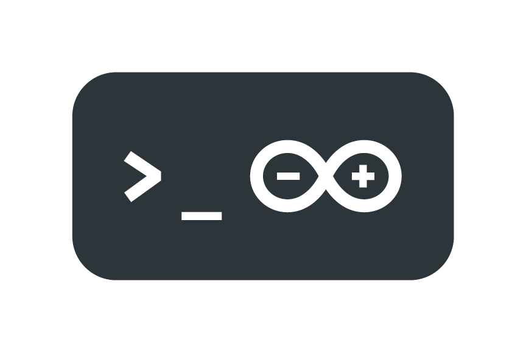

# arduino-cli

Arduino CLI is an all-in-one solution that provides Boards/Library Managers, sketch builder, board detection, uploader,
and many other tools needed to use any Arduino compatible board and platform.

> **Note:** this software is currently under active development: anything can change at any time, API and UI must be
> considered unstable until we release version 1.0.0.

## Docs

For guidance on installation and development, see the [User documentation].

## Quickstart

1. [Install] the Arduino CLI
1. Follow the [Getting Started] guide to check out what the CLI can do
1. Browse the [Commands reference] to see all the available commands
1. Should you have an issue, read the [FAQ] page

## How to contribute

Contributions are welcome!

Please read the document [How to contribute] which will show you how to build the source code, run the tests, and
contribute your changes to the project.

:sparkles: Thanks to all our [contributors]! :sparkles:

### Beta testing

[Nightly builds] are available for beta testing.

## Security

If you think you found a vulnerability or other security-related bug in the Arduino CLI, please read our [security
policy] and report the bug to our Security Team 🛡️ Thank you!

e-mail contact: security@arduino.cc

## License

Arduino CLI is licensed under the [GPL 3.0] license.

You can be released from the requirements of the above license by purchasing a commercial license. Buying such a license
is mandatory if you want to modify or otherwise use the software for commercial activities involving the Arduino
software without disclosing the source code of your own applications. To purchase a commercial license, send an email to
license@arduino.cc

[install]: https://arduino.github.io/arduino-cli/latest/installation
[user documentation]: https://arduino.github.io/arduino-cli/latest/
[getting started]: https://arduino.github.io/arduino-cli/latest/getting-started/
[commands reference]: https://arduino.github.io/arduino-cli/latest/commands/arduino-cli
[faq]: https://arduino.github.io/arduino-cli/latest/FAQ/
[how to contribute]: https://arduino.github.io/arduino-cli/latest/CONTRIBUTING/
[contributors]: https://github.com/arduino/arduino-cli/graphs/contributors
[nightly builds]: https://arduino.github.io/arduino-cli/latest/installation/#nightly-builds
[security policy]: https://github.com/arduino/arduino-cli/security/policy
[gpl 3.0]: https://www.gnu.org/licenses/gpl-3.0.en.html
