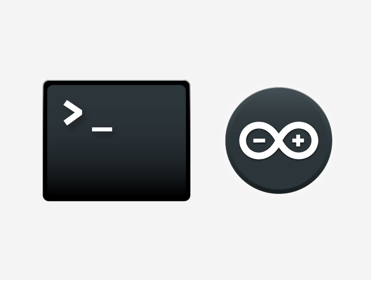

# arduino-cli

Arduino CLI is an all-in-one solution that provides builder, boards/library manager,
uploader, discovery and many other tools needed to use any Arduino compatible
board and platforms.

[![tests-badge]](https://github.com/Arduino/arduino-cli/actions?workflow=test)
[![nightly-badge]](https://github.com/Arduino/arduino-cli/actions?workflow=nightly)
[![docs-badge]](https://github.com/Arduino/arduino-cli/actions?workflow=docs)
[![codecov-badge]](https://codecov.io/gh/arduino/arduino-cli)

> **Note:** this software is currently under active development: anything can change
  at any time, API and UI must be considered unstable until we release version 1.0.0.

## Docs

For guidance on installation and development, see the [User documentation].

## Quickstart

1. [Install] the Arduino CLI
2. Follow the [Getting Started] guide to check out what the CLI can do
3. Browse the [Commands reference] to see all the available commands
4. Should you have an issue, read the [FAQ] page

## How to contribute

Contributions are welcome!

Please read the document [How to contribute] which will show you how to build
the source code, run the tests, and contribute your changes to the project.

:sparkles: Thanks to all our [contributors]! :sparkles:

[tests-badge]: https://github.com/Arduino/arduino-cli/workflows/test/badge.svg
[nightly-badge]: https://github.com/Arduino/arduino-cli/workflows/nightly/badge.svg
[docs-badge]: https://github.com/Arduino/arduino-cli/workflows/docs/badge.svg
[codecov-badge]: https://codecov.io/gh/arduino/arduino-cli/branch/master/graph/badge.svg
[Install]: https://arduino.github.io/arduino-cli/installation
[User documentation]: https://arduino.github.io/arduino-cli/
[Getting Started]: https://arduino.github.io/arduino-cli/getting-started/
[Commands reference]: https://arduino.github.io/arduino-cli/commands/arduino-cli
[FAQ]: https://arduino.github.io/arduino-cli/FAQ/
[How to contribute]: https://arduino.github.io/arduino-cli/CONTRIBUTING/
[contributors]: https://github.com/arduino/arduino-cli/graphs/contributors
